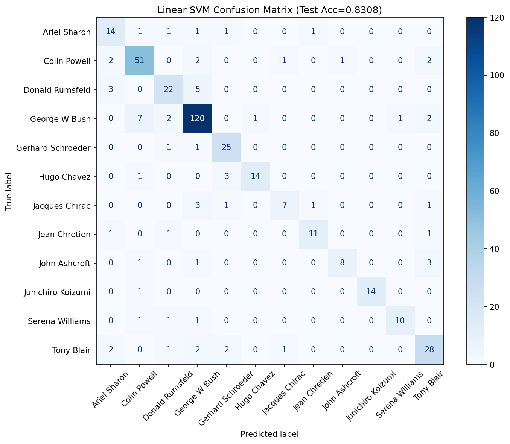
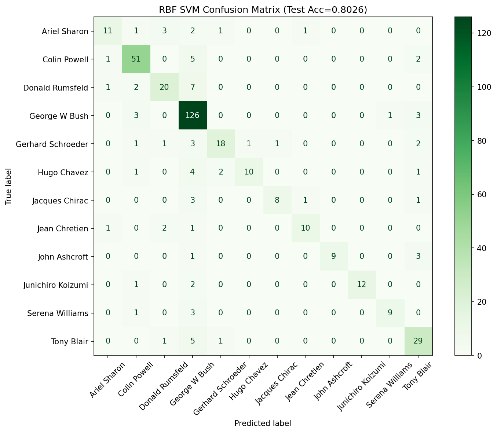

# SVM Face Classification (LFW)

Face classification on the LFW dataset using Linear and RBF SVM with `StandardScaler`. Hyperparameters are tuned on a validation split, then the best model is retrained on train+val and evaluated on a held-out test set. Includes an optional PCA step for dimensionality reduction.

## Models
### Linear SVM
- Tuned: C over {0.01, 0.1, 1, 10, 100}
- Best model is retrained on train+val and evaluated on test

### RBF SVM
- Tuned: C over {0.1, 1, 10, 100}, γ over {scale, 0.001, 0.01, 0.1}
- Best model is retrained on train+val and evaluated on test

### Optional: PCA + SVM
Tests PCA variance ratios {0.90, 0.95, 0.99} and evaluates both Linear and RBF SVM after PCA.

## Confusion Matrices



## How to Run
1. Install:
   ```bash
   pip install -r requirements.txt
2. Run:
   ```bash
   python train.py